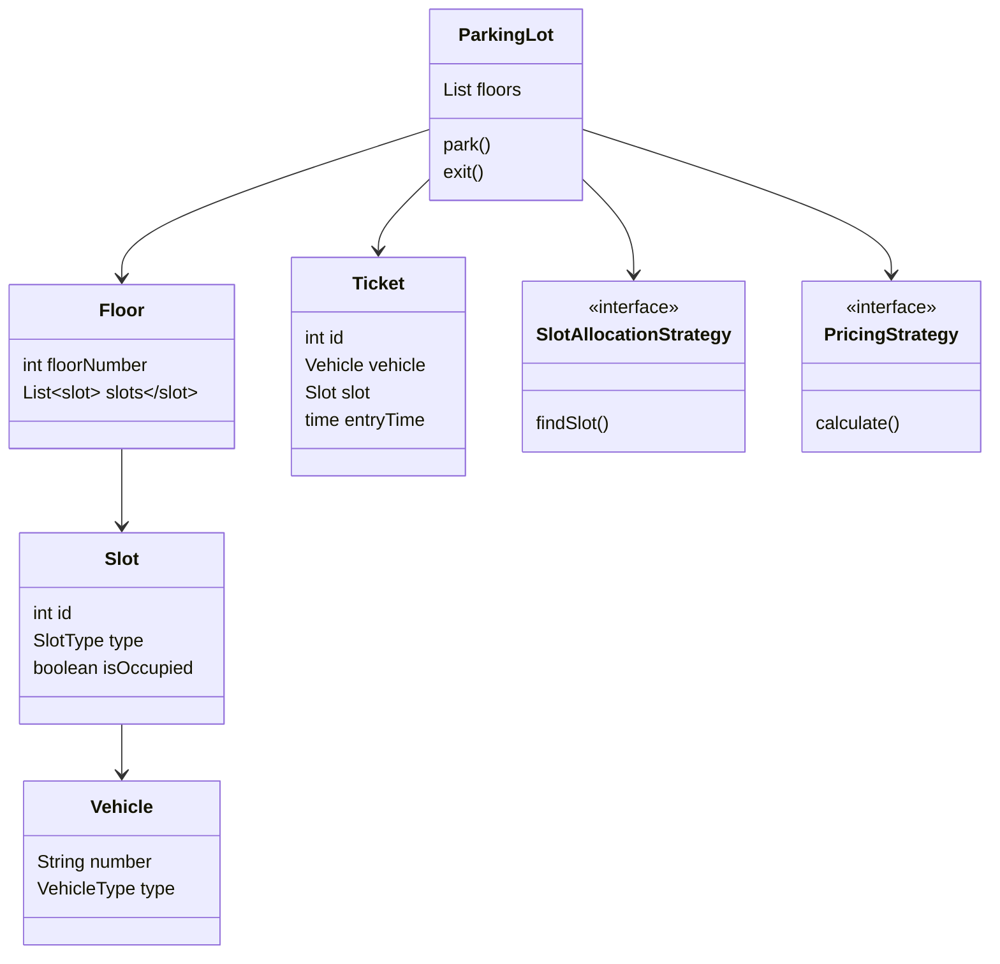

# Parking Lot Class Diagram

```mermaid
classDiagram
    class ParkingLot {
        List<Floor> floors
        park()
        exit()
    }

    class Floor {
        int floorNumber
        List<Slot> slots
    }

    class Slot {
        int id
        SlotType type
        boolean isOccupied
    }

    class Vehicle {
        String number
        VehicleType type
    }

    class Ticket {
        int id
        Vehicle vehicle
        Slot slot
        time entryTime
    }

    class SlotAllocationStrategy {
        <<interface>>
        findSlot()
    }

    class PricingStrategy {
        <<interface>>
        calculate()
    }

    ParkingLot --> Floor
    Floor --> Slot
    Slot --> Vehicle
    ParkingLot --> Ticket
    ParkingLot --> SlotAllocationStrategy
    ParkingLot --> PricingStrategy
```
