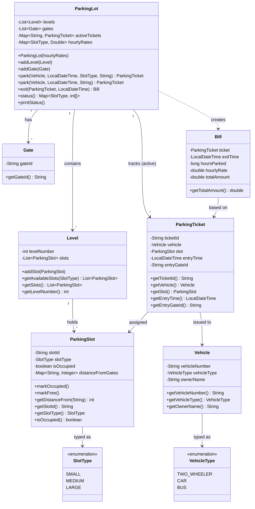

# FileSpark — Parking Lot System

A Java-based parking lot management system that handles multi-level parking, gate-based slot assignment, and billing.

---

## Class Diagram

---

## Architecture Overview

### Core Flow

1. **Entry** — A `Vehicle` calls `ParkingLot.park()` from a `Gate`. The lot walks a slot-type preference list (e.g. TWO_WHEELER → SMALL → MEDIUM → LARGE), collects all available slots of each type, and picks the one nearest to the entry gate by distance score.
2. **Ticket** — A `ParkingTicket` is issued and stored in `activeTickets`.
3. **Exit** — `ParkingLot.exit()` looks up the ticket, computes a `Bill` using the **slot type rate** (not vehicle type), frees the slot, and removes the ticket from active tracking.

### Slot Preference Rules

| Vehicle Type  | Preferred Slot Order           |
|---------------|-------------------------------|
| TWO_WHEELER   | SMALL → MEDIUM → LARGE        |
| CAR           | MEDIUM → LARGE                |
| BUS           | LARGE only                    |

### Billing Rules

- Rate is determined by **slot type**, not vehicle type.
- Minimum charge: **1 hour**.
- Partial hours are **rounded up** (ceiling).
